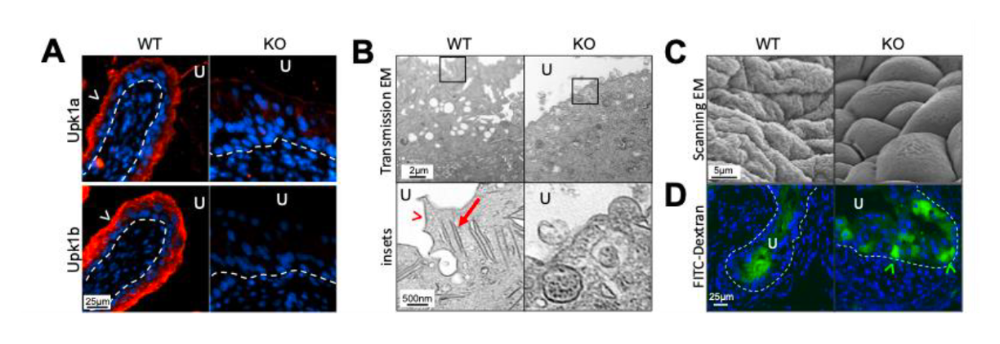

# Essential role for the urothelial plaque in Gram-negative urinary tract infections

## Introduction
Urothelial plaques are produced by bladder superficial urothelium cells and are composed of uroplakin proteins, including Upk1b. These plaques interact with UPEC type I fimbriae and are thought to contribute to bacterial attachment and invasion. To evaluate the role of the plaque in infection-associated host responses, this study used *Upk1b* knockout mice as a model of disrupted urothelial plaque function. Following UPEC inoculation, Upk1b KO mice exhibited reduced bacterial burden, impaired urothelial invasion, and absent intracellular bacterial communities, compared to wild-type hosts.

## Description
The code in this repository is mainly used for RNA-seq analysis of bladder samples from *Upk1b* knockout and wild-type mice following UPEC infection. The workflow includes preprocessing of RNA-seq data, pairwise comparisons between experimental groups, and global comparisons across all groups to identify transcriptional changes associated with plaque disruption and UPEC infection.

These analyses were used to characterize host immune and inflammatory pathways affected by loss of *Upk1b*, providing transcriptomic support for the role of the urothelial plaque in UPEC invasion, establishment of urinary tract infection, and activation of the innate immune response.

## Datasets
RNA was isolated from female Upk1b WT and KO bladders (4 biological replicates/group) at baseline and 24 hr following infected with UTI89 using the MirVanaTM ParisTM kit (Thermo Fisher). Bulk RNA sequencing (RNA-seq) was performed by the Genomic Services Laboratory at Nationwide Children’s Hospital.

## Methods

1. RNA-seq Preprocessing .
2. Differentially Expression Analysis
3. Functional enrichment Analysis
4. Transcrition factor and signaling pathway activation inference.

##  Workflow

**Step 1 — Preprocessing** ([scripts/01_preprocessing/](scripts/01_preprocessing/))

Raw FASTQ files were trimmed with Trim Galore, aligned to the mouse genome (mm10) using TopHat2, and filtered for uniquely mapped reads with SAMtools. Gene-level read counts were generated with HTSeq-count.

**Step 2 — Pairwise Differential Expression Analysis** ([scripts/02_pairwise_comparisons/](scripts/02_pairwise_comparisions/))

Count data were normalized using TMM in edgeR. DEGs were identified by quasi-likelihood F-test (FDR ≤ 0.05, |log2FC| ≥ 0.58) across five pairwise contrasts between FVB and *Upk1b* KO groups at baseline and 24 hpi. GO enrichment, transcription factor activity (decoupleR), and signaling pathway activity (PROGENy) were assessed for each contrast.

**Step 3 — Cross-group Comparison** ([scripts/03_all_groups_comparison/](scripts/03_all_groups_comparision/))

DEGs from all contrasts were integrated and compared across groups using clusterProfiler. Innate and adaptive immune pathways, cytokine and chemokine expression, and transcription factor activity were visualized across all conditions.

## Citation

Jackson, AR., Li, B., EIHaraken, M., Cortado, H., Gupta, S., Ballash, G., Ching, CB, Wang, X., Becknell, B. **Essential role for the urothelial plaque in Gram-negative urinary tract infections**, Scientific Reports (2026). 

[] (https://doi.org/10.5281/zenodo.20763786)

## Copyright
For more detail information, please feel free to contact: xin.wang@nationwidechildrens.org

Copyright (c) 2026 Xin Wang

Current version v1.0
